# 📊 GitHub Stats:
 

## 🏆 GitHub Trophies

## 🚀 Featured Projects
#### 🔍 Hardest Project — [Extension-of-Consistent-Approximation-Fixpoint-Theory-Proofs](https://github.com/UpTheShipCreek/Extension-of-Consistent-Approximation-Fixpoint-Theory-Proofs)

Formalization of Domain Theoretic proofs, used in Fixpoint Semantics and Non-Monotonic reasoning, in Lean 4.

#### 📦 Largest Project — [Project2023](https://github.com/UpTheShipCreek/Project2023)

 A project implementing state-of-the-art approximate KNNs algorithms, used in Data Science and Machine Learning, in C++.

## 🧠 Interests

 I'm particularly interested in Logic, Machine Learning, and everything related to Artificial Intelligence and I believe that the next step in AI lies in a synthesis of symbolic reasoning and statistical learning.

